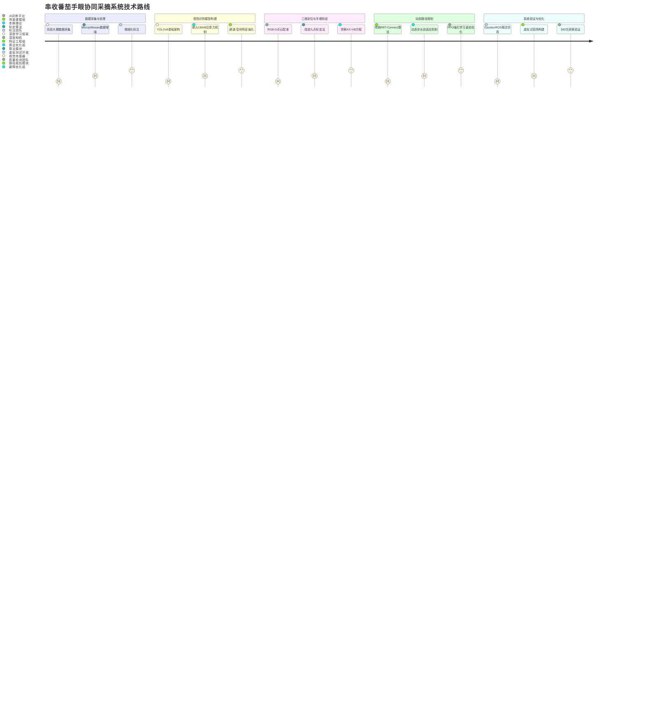

```mermaid
journey
    title 串收番茄手眼协同采摘系统技术路线
    section 数据采集与处理
      实验大棚数据采集: 1: 视觉传感器
      MixUp/Mosaic数据增强: 2: 算法模块
      精细化标注: 3: 标注团队
    
    section 视觉识别模型构建
      YOLOv8基础架构: 1: 深度学习框架
      嵌入CBAM注意力机制: 2: 算法优化组
      通道-空间特征强化: 3: 特征工程组
    
    section 三维定位与手眼标定
      RGB-D点云配准: 1: 深度相机
      改进九点标定法: 2: 标定算法
      求解AX=XB方程: 3: 李群理论
    
    section 动态路径规划
      传统RRT-Connect算法: 1: 路径规划模块
      动态步长自适应机制: 2: 避障优化组
      PPO强化学习姿态优化: 3: AI训练平台
    
    section 系统验证与优化
      Gazebo/ROS联合仿真: 1: 虚拟测试环境
      虚拟试验场构建: 2: 场景建模组
      500次采摘验证: 3: 质量检测团队
```